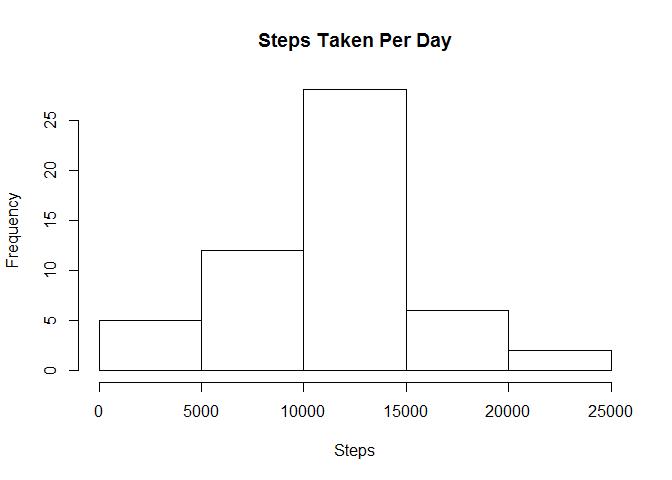
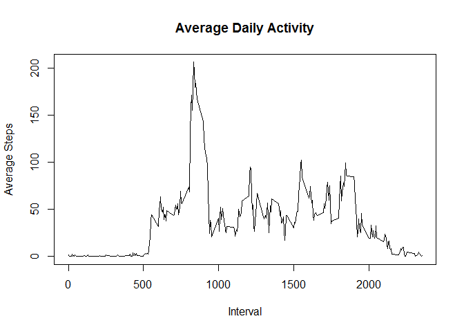
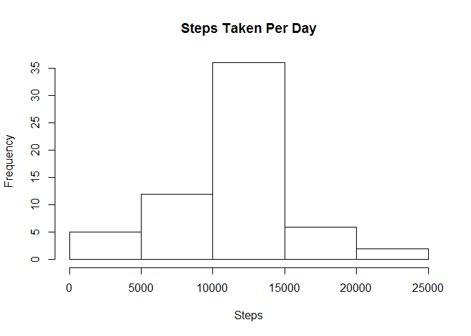
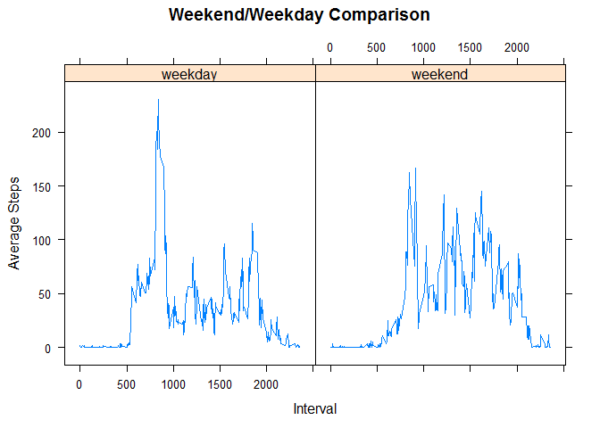

# Reproducible Research: Peer Assessment 1


## Loading and preprocessing the data
Read in the activity data file and assign it to a data frame.


```r
data <- read.csv("activity.csv")
```


## What is mean total number of steps taken per day?
First we aggregate the step information, segmenting by day. Then we calculate the mean and median on that aggregated data set.


```r
stepsPerDay <- aggregate(data$steps, by = list(Day=data$date), sum)
hist(stepsPerDay$x, main="Steps Taken Per Day", xlab="Steps", ylab="Frequency")
```

 

```r
mean(stepsPerDay$x, na.rm = TRUE)
```

```
## [1] 10766.19
```

```r
median(stepsPerDay$x, na.rm = TRUE)
```

```
## [1] 10765
```


## What is the average daily activity pattern?
First we aggregate the step information, segmenting by the time interval each day. We plot the result to see the average number of steps taken at that time interval each day to identify daily patterns.


```r
avgStepsPerInterval <- aggregate(data$steps, by = list(Interval=data$interval),na.rm=TRUE, mean)
series <- ts(avgStepsPerInterval)
plot(series[,'Interval'],series[,'x'], type="l", main="Average Daily Activity"
     , xlab="Interval", ylab="Average Steps")
```

 

```r
subset(avgStepsPerInterval, x==max(avgStepsPerInterval$x), select=Interval)
```

```
##     Interval
## 104      835
```


## Imputing missing values
To impute the missing values, first we take a copy of the existing dataset. Then we update the copy by converting the NA values into the time interval averages (using the other days with valid step data).

```r
fullData <- data

fullData$steps[is.na(fullData$steps)] <- ave(fullData$steps,
    fullData$interval,
    FUN=function(x)mean(x,
    na.rm = T))[is.na(fullData$steps)]
```

Then we sum the steps per each day to be able to create a histogram and calculate the mean and median. 

```r
stepsPerDay <- aggregate(fullData$steps, by = list(Date=fullData$date),sum)

hist(stepsPerDay$x, main="Steps Taken Per Day", xlab="Steps", ylab="Frequency")
```

 

```r
mean(stepsPerDay$x, na.rm = TRUE)
```

```
## [1] 10766.19
```

```r
median(stepsPerDay$x, na.rm = TRUE)
```

```
## [1] 10766.19
```
We see that filling in the NA values removes the slight bias or the small difference between the average and median that we saw in a previous question.


## Are there differences in activity patterns between weekdays and weekends?
To answer this, we first need to segment the data between weekend and weekday data and get the average steps per interval for each segment.

```r
library(lattice)
fullData$date <- as.Date(fullData$date)
weekend <- c('Saturday','Sunday')
fullData$weekday <- factor((weekdays(fullData$date) %in% weekend), 
        levels=c(FALSE, TRUE), labels=c('weekday', 'weekend') )
fullDataWD <- subset(fullData,fullData$weekday=="weekday")
fullDataWE <- subset(fullData,fullData$weekday=="weekend")
avgStepsPerIntervalWD <- aggregate(fullDataWD$steps,by=list(Interval=fullDataWD$interval), mean)
avgStepsPerIntervalWE <- aggregate(fullDataWE$steps,by=list(Interval=fullDataWE$interval), mean)
```
Then we need to combine the segments to allow us to plot the data side-by-side.

```r
seriesWD <- cbind(avgStepsPerIntervalWD,weekday='weekday')
seriesWE <- cbind(avgStepsPerIntervalWE,weekday='weekend')
series <- rbind(seriesWD,seriesWE)
xyplot(x ~ Interval | factor(weekday), data=series, type="l", main="Weekend/Weekday Comparison", xlab="Interval", ylab="Average Steps")
```

 

We see there is a difference between weekday and weekend patterns.

